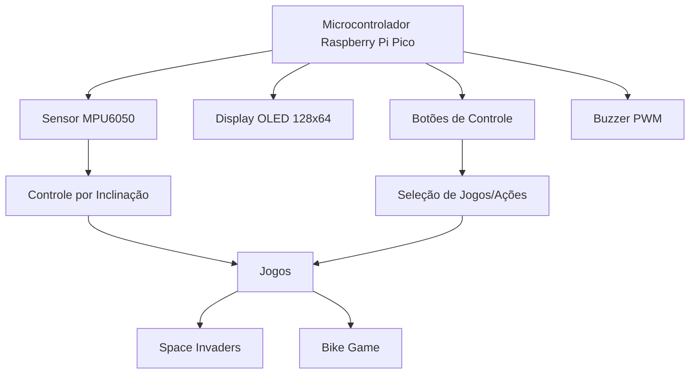
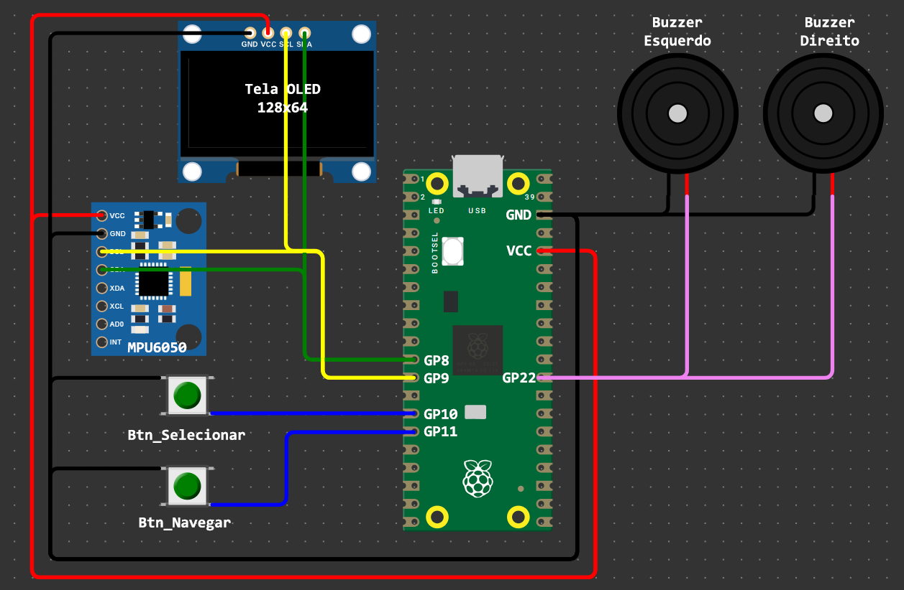

# Console Portátil - Projeto Semestral  

Console Portátil é um sistema embarcado desenvolvido como projeto semestral da disciplina Microcontroladores e Sistemas Embarcados (EEN251) do Instituto Mauá de Tecnologia. Trata-se de um console de jogos portátil e modular, capaz de executar múltiplos jogos com diferentes mecânicas de controle, combinando interfaces tradicionais (botões) com controles por movimento (acelerômetro).

## Sumário
- [Requisitos](#requisitos)
- [Escopo](#escopo)
- [Diagrama de blocos](#diagrama-de-blocos)
- [Tecnologias](#tecnologias)
- [Materiais](#materiais)
- [Modelagem financeira](#modelagem-financeira)
- [Funcionamento](#funcionamento)
- [Testes](#testes)
- [Autores](#autores)

## Requisitos
| ID | Requisito | Tipo |
|----|-----------|------|
| 1  | Utilizar sensores analógicos/digitais | Técnico |
| 2  | Executar múltiplos jogos com mecânicas diferentes | Funcional |
| 3  | Interface gráfica OLED para exibição de jogos | Funcional |
| 4  | Sistema de controle por inclinação (acelerômetro) | Técnico |
| 5  | Utilizar microcontrolador Raspberry Pi Pico | Técnico |
| 6  | Comunicação I2C para sensores e display | Técnico |
| 7  | Interação com usuário via botões físicos | Técnico |
| 8  | Efeitos sonoros via buzzer PWM | Funcional |

## Escopo
O projeto consiste em um console portátil que executa dois jogos diferentes:  
1. **Space Invaders**: Jogo de nave espacial com sistema de tiros  
2. **Bike Game**: Jogo de corrida com desvio de obstáculos  

O console utiliza um acelerômetro para controle de movimento, botões para ações, display OLED para interface e buzzer para efeitos sonoros.

## Diagrama de blocos


## Tecnologias
- **I2C**: Comunicação com display OLED e sensor MPU6050
- **PWM**: Geração de efeitos sonoros no buzzer
- **GPIO Digital**: Leitura de botões e controle de periféricos
- **Filtragem de Sinais**: Suavização de leituras do acelerômetro
- **Programação Orientada a Objetos**: Estrutura modular para jogos

## Materiais
| Componente | Quantidade |
|------------|------------|
| Raspberry Pi Pico | 1 |
| Sensor MPU6050 (Acelerômetro/Giroscópio) | 1 |
| Display OLED 128x64 (I2C) | 1 |
| Botões táteis 12x12mm | 2 |
| Buzzer | 2 |
| Cabos | Conjunto |
| Baterias 18650 | 1 |
| Estrutura impressa em 3D (PLA) | 1 conjunto |


**Diagrama de conexões:**


```
Raspberry Pi Pico:
  GP8  -> SDA (OLED + MPU6050)
  GP9  -> SCL (OLED + MPU6050)
  GP10 -> Botão Seleção
  GP11 -> Botão Navegação
  GP22 -> Buzzer (PWM)
```

## Modelagem financeira

| Item | Preço Unitário (R$) | Quantidade | Preço Total (R$) |
|------|---------------------|------------|------------------|
| Raspberry Pi Pico | 35,00 | 1 | 35,00 |
| Display OLED 128x64 | 40,00 | 1 | 40,00 |
| Sensor MPU6050 | 15,00 | 1 | 15,00 |
| Botões táteis | 0,80 | 2 | 1,60 |
| Buzzer passivo | 1,50 | 2 | 3,00 |
| Baterias 18650 | 25,00 | 1 | 25,00 |
| Filamento ABS | 120,00/kg | 0.1kg | 12,00 |
| **TOTAL** | | | **91,6** |

## Funcionamento
O console opera através de um sistema hierárquico:

1. **Inicialização**: 
   - Configuração de periféricos (I2C, GPIO, PWM)
   - Calibração do acelerômetro
   
2. **Menu Principal**:
   - Navegação entre jogos com botão GP11
   - Seleção com botão GP10
   
3. **Execução de Jogos**:
   - **Space Invaders**:
     - Controle de nave por inclinação
     - Tiro com botão GP10
     - Saída com botão GP11
   - **Bike Game**:
     - Controle de direção por inclinação

## Testes

[Vídeo demonstração](linkdovideo)

## Autores
  -Amanda Carolina Ambrizzi Ramin (22.00721-0)
  
  -André Felipe Silva Xavier (22.01339-3) 
  
  -Otto Camargo Kuchkarian (22.00571-4) 
  
  -Rafael Assanti (22.01464-0) 
  
  -Rodrigo Fernandes Faltz (21.01660-7) 

---

**Instituto Mauá de Tecnologia**  
*Microcontroladores e Sistemas Embarcados - EEN251*  
Junho de 2025
